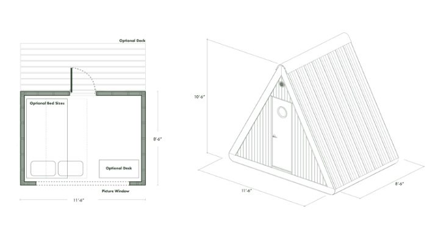

# A tiny house that you can take with you on the road

The creation of mobile homes, trailers, prefabricated huts and log cabins has long been put on stream, because there are more and more enthusiasts who prefer a small-sized housing and minimalist lifestyle. American companies are particularly successful in this direction, because in this country life on wheels is not a gimmick. This time, the surprise is the miniature Bivvi Cabin model, which is easy and quick to set up anywhere, from a single-axle trailer to a platform in the woods, fields, and even on a raft.

## Today's realities and the pandemic looming have changed some ideas about both office work and stationary living. More and more often you can find people who are not tied to one place, but strive for complete freedom, turning into digital nomads.

- Synopsis: Digital nomads are a new social category of people who prefer to lead a mobile lifestyle, and perform their professional duties quite skillfully not in the office, but in a convenient place (forest, mountains, river, seashore, etc.), using digital telecommunication technologies.

These are people who are not willing to sacrifice either their work or their desire to travel. Consequently, they should be able to move around carefree together with a comfortable accommodation with at least a bed and a workspace.

Tiny mobile homes are ideal for the digital nomad, but despite the fact that a huge number of models are created, their price is prohibitive and for most inaccessible. Although today's travelers occasionally have the opportunity to purchase an affordable home (by American standards), but unfortunately, lower prices entail a significant reduction in comfort.

According to the creators, this handsome cabin came about quite by accident while working on another project. That's when they realized there was a gap in the market that could easily be filled. "The market was overflowing with tent, yurt and trailer options. What was missing was a simple, well-designed small cabin that didn't require long and expensive assembly at a chosen site, in which to spend a vacation or weekend at any time of year and regardless of the climate zone. So we decided to build our own cabin to make life easier for today's outdoor enthusiasts," explain their decision Bivvi Camp specialists.

